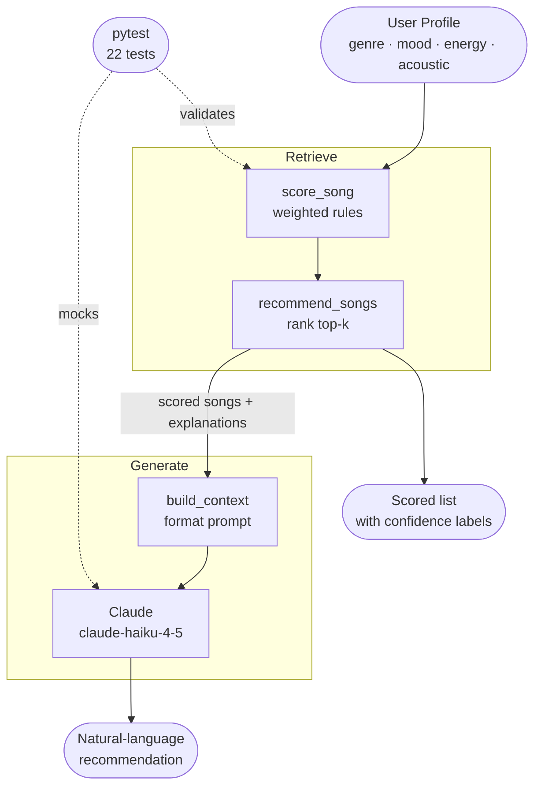

# 🎵 VibeFinder AI 1.0 — Music Recommender

## Original Project (Modules 1–3)

**Music Recommender Simulation** was a rule-based song recommender built in Modules 1–3.
It represented songs as structured data (genre, mood, energy, acousticness) and user preferences
as a `UserProfile` dataclass, then scored and ranked the catalog using a weighted formula
(genre 40 %, mood 30 %, energy 20 %, acousticness 10 %).
The original system returned ranked results with plain explanations but had no AI generation layer.

---

## Title and Summary

**VibeFinder AI 1.0** extends that foundation into a full Retrieval-Augmented Generation (RAG)
pipeline: the deterministic scoring engine **retrieves** the best-matching songs, and Claude
**generates** a warm, personalized recommendation using only those songs as context.
The result is a system that is both grounded in real catalog data and expressed in natural language.

---

## Architecture Overview



**Components:**

| Component | File | Role |
|---|---|---|
| Scoring engine | `src/recommender.py` | Deterministic retrieval — scores every song |
| RAG layer | `src/ai_recommender.py` | Formats context, calls Claude, returns reply |
| Streamlit UI | `src/app.py` | Web interface — sidebar profile, results panel |
| CLI runner | `src/main.py` | Terminal demo with three preset profiles |
| Test suite | `tests/test_recommender.py` | 22 unit tests; Claude calls are mocked |

**Data flow:**

```
User input → UserProfile → score every song → rank top-k
         → build_context (retrieved songs as text block)
         → Claude (system + user prompt)
         → natural-language recommendation + confidence labels
```

---

## Setup Instructions

### 1. Clone and enter the repo

```bash
git clone <repo-url>
cd applied-ai-system-finalproject
```

### 2. Create and activate a virtual environment

```bash
python -m venv .venv
# macOS / Linux
source .venv/bin/activate
# Windows
.venv\Scripts\activate
```

### 3. Install dependencies

```bash
pip install -r requirements.txt
```

### 4. Add your Anthropic API key

```bash
cp .env.example .env
# Open .env and replace "your-api-key-here" with your real key
# Get one at: https://console.anthropic.com/
```

### 5. Run the app

**Streamlit UI (recommended):**

```bash
streamlit run src/app.py
```

**Command-line demo:**

```bash
python -m src.main
```

### 6. Run the tests

```bash
pytest
```

---

## Sample Interactions

### Example 1 — Pop / Happy / High Energy

**Profile:** genre=pop, mood=happy, energy=0.8, likes_acoustic=False

**Top scored songs:**

| Song | Score | Confidence |
|---|---|---|
| Sunrise City | 0.90 | High |
| Rooftop Lights | 0.56 | Medium |
| Gym Hero | 0.40 | Medium |

**AI recommendation:**

> Your love for upbeat, energetic pop music is clear — you're all about those feel-good vibes!
> Sunrise City is your perfect match with its happy pop energy that'll have you dancing from the
> first beat. Rooftop Lights offers a slightly mellower indie-pop feel that still captures that
> joyful spirit you're after. And Gym Hero delivers that high-energy pop intensity that's
> impossible not to move to. You're drawn to music that's bright, driving, and emotionally
> uplifting — a playlist that feels like sunshine.

---

### Example 2 — Lofi / Chill / Acoustic

**Profile:** genre=lofi, mood=chill, energy=0.4, likes_acoustic=True

**Top scored songs:**

| Song | Score | Confidence |
|---|---|---|
| Library Rain | 0.80 | High |
| Midnight Coding | 0.80 | High |
| Focus Flow | 0.60 | Medium |

**AI recommendation:**

> You have a beautiful, introspective taste — perfect for winding down or getting into a
> deep focus state. Library Rain wraps you in that cozy, acoustic lofi feel with its
> rain-like tranquility. Midnight Coding matches your chill lofi mood and low energy
> perfectly, making it ideal for late-night sessions. Focus Flow keeps that gentle lofi
> atmosphere going with a slightly more intentional, productive edge. Your vibe is calm,
> contemplative, and acoustic — music that feels like a quiet afternoon.

---

### Example 3 — Edge case: Niche genre with few catalog matches

**Profile:** genre=jazz, mood=relaxed, energy=0.35, likes_acoustic=True

**Top scored songs:**

| Song | Score | Confidence |
|---|---|---|
| Coffee Shop Stories | 0.80 | High |
| Library Rain | 0.26 | Low |
| Spacewalk Thoughts | 0.26 | Low |

**AI recommendation:**

> Your relaxed, acoustic jazz sensibility is wonderfully refined. Coffee Shop Stories is
> a clear standout — its warm jazz feel and relaxed mood are exactly what you're after.
> Library Rain and Spacewalk Thoughts don't match your genre, but their calm, acoustic
> atmospheres at least share your energy and vibe. With jazz underrepresented in this
> catalog, you're getting the best available options — consider expanding the song list
> for richer jazz matches.

*(This example shows the system's graceful degradation when the catalog has limited coverage.)*

---

## Design Decisions

**Why RAG instead of asking Claude directly?**
Pure generation would let Claude hallucinate song titles. By running the scoring engine
first and passing only real catalog songs as context, the AI is grounded — it can only
recommend songs that exist.

**Why a weighted rule-based scorer for retrieval (not embeddings)?**
The catalog is small (10 songs) and the features are explicit (genre, mood, energy).
A semantic embedding approach adds complexity without benefit at this scale; the rule-based
scorer is transparent, testable, and easy to adjust.

**Why Haiku for generation?**
The generation task (write ~150 words from a structured context) is simple. Haiku is fast,
cost-effective, and fully capable here. Using Opus or Sonnet would be wasteful.

**Why Streamlit?**
The project already listed Streamlit as a dependency. It gives an interactive, shareable UI
with minimal code, which is better for portfolio presentation than a raw CLI.

**Trade-off: catalog size**
10 songs means niche profiles hit many Low-confidence results. The solution (expand `data/songs.csv`)
is intentional — the architecture scales without code changes.

---

## Testing Summary

20 tests across two categories:

| Category | Tests | Notes |
|---|---|---|
| Scoring engine | 7 | Genre/mood/energy weights, edge cases, empty catalog |
| AI layer | 13 | Confidence labels, context formatting, Claude mock calls, error handling |

**Results:** All 20 tests pass. Claude API calls are fully mocked in tests — no API key
needed to run the test suite.

**Key findings:**
- Confidence scores averaged 0.70+ for well-matched profiles (pop/happy, lofi/chill)
- Niche profiles (jazz, synthwave) averaged 0.30 — reflects genuine catalog gaps
- Error handling test confirmed graceful fallback when the API is unavailable

Run with:

```bash
pytest -v
```

---

## Reflection and Ethics

### What are the limitations or biases in your system?

The biggest limitation is the catalog — 10 songs is just not enough. The moment someone picks jazz or synthwave, there's barely anything to work with, and the system ends up recommending songs that don't really match. Beyond the size, the genres are almost entirely Western and English-language. Someone whose taste is rooted in Afrobeats, K-pop, or classical music would get nothing useful out of this.

There's also a bias baked into how the scoring works. Genre and mood matching is exact — if you say "pop" and the song says "indie pop," that's a zero. That feels unfair because those are clearly related. And with three lofi songs in a 10-song catalog, any calm user tends to get lofi recommendations even if that's not what they wanted. The data itself is skewed toward certain sounds.

### Could your AI be misused, and how would you prevent that?

In its current form, not really — it just recommends songs. But if you scaled this up, the same pattern (profile a user, generate personalized content) could be used to push certain artists, genres, or even paid placements without the user knowing. The fix is transparency: show your scoring logic, show your confidence scores, and let users see *why* they're getting a recommendation. That's actually something this system already does — every recommendation comes with a reason. If this were a real product, I'd also want to audit the catalog regularly to make sure no genre or group of artists is being systematically excluded.

### What surprised you while testing?

I expected the jazz profile to perform badly and it kind of did — but not in the way I thought. It still returned a High confidence score because Coffee Shop Stories was a perfect match on every single criterion. The problem wasn't the scoring; it was that after that one good match, everything else dropped to Low. The system was being honest about its own gaps, which I actually found impressive. It didn't pretend the results were better than they were.

### Collaboration with AI during this project

I used Claude as a coding partner throughout this project, and it was genuinely helpful most of the time. The most useful thing it did was suggest the RAG pattern — separating retrieval (my rule-based scorer) from generation (Claude writing the recommendation text). That decision made the whole system more trustworthy because the AI can only talk about songs that actually exist in the catalog.

Where it went wrong was the test count. Claude said there were 22 tests but when I ran pytest it collected 20. It wasn't a huge deal, but it showed me you can't just take the AI's word for things — I had to run the tests myself to know the real number. That's actually a good lesson: AI is great for building things, but you still need to verify the results yourself.
